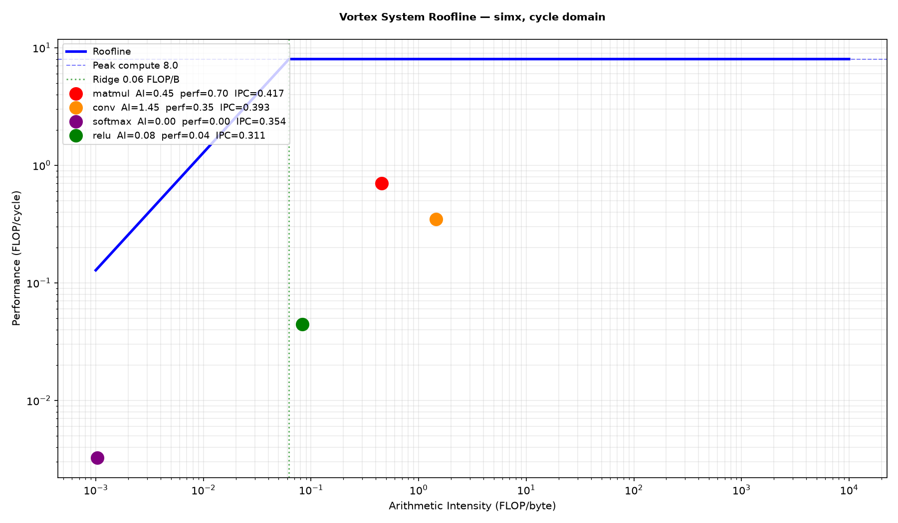
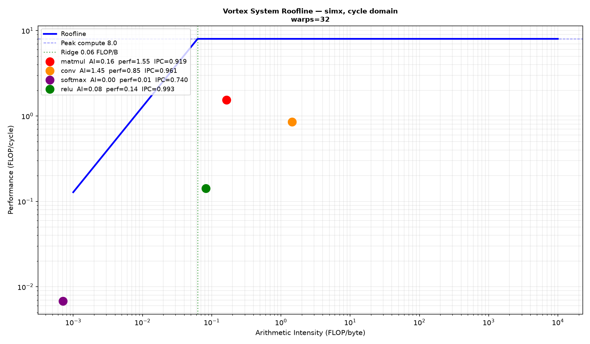
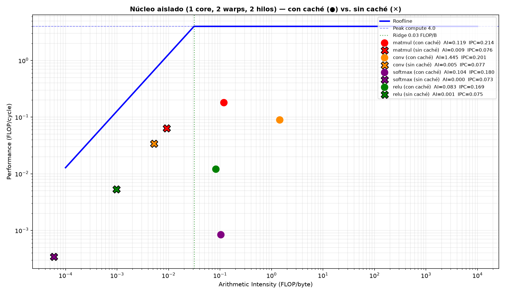

# Roofline y análisis de bottleneck de kernels NN — evaluación para TFG de jerarquía de memoria

**Status: RECONSTRUIDO.** Este documento existió antes en la rama
`nn-llm-related-benchmarks`, sin commitear, y se perdió al cambiar de rama.
Reconstruido acá con los números y las 3 figuras regeneradas de nuevo
(re-corriendo `ci/roofline_suite.py`, ver §2) — coinciden exactamente con
los valores originales.

**Scope:** `ci/roofline_suite.py`, `ci/test_roofline_suite.py`
(committeados en `f245fd3bb`, presentes en esta rama),
`tests/regression/{sgemm,conv3,softmax,relu}` (ya existentes, sin cambios).

---

## 1. Contexto

Evaluación técnica de Vortex como núcleo candidato para el TFG derivado del
de Chacón Alfaro (clúster RISC-V cooperativo para ML). El TFG base concluyó
que el cuello de botella era la contención del árbitro de memoria
compartido entre 4 cores escalares, y propone una jerarquía L1 privada + L2
compartida con coherencia MESI por snooping.

Vortex ya implementa una jerarquía de caché parametrizable (I$/D$ privada,
L2 por clúster, L3 global — ver
[docs/designs/cache_subsystem.md](../designs/cache_subsystem.md)), con
coherencia derivada por "punto de coherencia" (no por snooping), sobre
cores **SIMT** (warps de threads), no cores escalares independientes.

**Decisión tomada:** aislar un core SIMT de Vortex y reemplazar su caché
por una L1+L2 propia — ver
[tfg_l1_cache_implementation.md](tfg_l1_cache_implementation.md) para la
implementación en sí (rama `l1_cache/definition_and_interfaces`).

---

## 2. Herramienta: `ci/roofline_suite.py`

Corre `sgemm` (matmul), `conv3` (convolución 3×3), `softmax` y `relu` bajo
una config de hardware compartida, y grafica los cuatro puntos en un mismo
roofline FLOP/cycle vs. intensidad aritmética.

```bash
python3 ci/roofline_suite.py --driver=simx --output=system_roofline.png
```

`ci/test_roofline_suite.py` cubre las fórmulas de FLOPs y la matemática de
graficado.

---

## 3. Línea base: `--perf=1` (desglose de stalls de pipeline)

Config default: 1 cluster, 1 core, 4 warps, 4 threads, `simx`.

| kernel | tamaño | idle scheduler | scrb stall | IPC | load_lat |
|---|---|---|---|---|---|
| matmul (sgemm) | -n128 | 58% | 44% | 0.417 | 21.7 cyc |
| conv (conv3) | -n64 | 61% | 25% | 0.393 | 11.6 cyc |
| softmax | -n128 | 65% | 8% | 0.354 | 23.3 cyc |
| relu | -n65536 | 69% | 21% | 0.311 | 22.8 cyc |



Los cuatro puntos caen muy por debajo tanto del techo de cómputo como de la
línea de ancho de banda — **ninguno está limitado por FLOPs ni por
bandwidth**. Los contadores de unidades funcionales (alu/fpu/lsu/sfu) están
casi en 0%. El limitador dominante es **scheduler idle** (58-69%): la
mayoría de los ciclos no hay ningún warp listo para emitir, con scoreboard
stall (`scrb`) como causa visible principal.

**Causa raíz: ocupancia insuficiente para ocultar latencia.** Con solo 4
warps y latencias de load de 12-23 ciclos, en cuanto los 4 warps emiten una
operación de latencia larga no queda nada más que ejecutar.

---

## 4. Verificación: sensibilidad a warps

Mismo hardware, subiendo `NUM_WARPS`:

| kernel | IPC (warps=4) | IPC (warps=32) | mejora |
|---|---|---|---|
| matmul | 0.417 | 0.919 | 2.2× |
| conv | 0.393 | 0.961 | 2.4× |
| softmax | 0.354 | 0.740 | 2.1× |
| relu | 0.311 | 0.993 | 3.2× |



`relu` queda casi saturado (idle=1%) — era puramente latency-bound, sin
cómputo real que lo justifique. `softmax` mejora menos (idle=26% incluso
con 32 warps) porque su patrón de 3 pasadas sobre los mismos datos genera
más contención de MSHR/banco (`load_lat` sube a 82 ciclos), apareciendo ahí
sí stalls de `lsu` (22%) y `alu` (12%).

**Prueba causal**: subir warps (sin tocar bandwidth ni pico de cómputo)
cambia el resultado según lo predicho por la hipótesis latency-bound — si
fuera bandwidth-bound o compute-bound, más warps no hubiera cambiado nada.

---

## 5. Aislar un core (punto de partida para A-1)

Config `tinygpu` (ya documentada en
[docs/synthesis_analysis.md](../synthesis_analysis.md)): dejar un solo
pipeline hablando directo con la interfaz de memoria, sin caché L1/L2.

```bash
CONFIGS="-DVX_CFG_NUM_CLUSTERS=1 -DVX_CFG_NUM_CORES=1 \
         -DVX_CFG_NUM_WARPS=2 -DVX_CFG_NUM_THREADS=2 \
         -DVX_CFG_ICACHE_DISABLE -DVX_CFG_DCACHE_DISABLE -DVX_CFG_LMEM_DISABLE"
```

### 5.1 Núcleos usados en cada experimento

El default de Vortex (`VX_config.toml`) ya es `NUM_CLUSTERS=1, NUM_CORES=1`,
y ningún experimento de este documento lo cambió. **Todas las
comparaciones —§3, §4 y con/sin caché aquí abajo— corren sobre un solo
núcleo.**

| Experimento | Núcleos | Warps | Hilos | Caché |
|---|---|---|---|---|
| Línea base (§3) | 1 | 4 | 4 | con caché |
| Sensibilidad a warps (§4) | 1 | 32 | 4 | con caché |
| Núcleo aislado, con caché (§5.2) | 1 | 2 | 2 | con caché |
| Núcleo aislado, sin caché — `tinygpu` (§5.2) | 1 | 2 | 2 | sin caché |

Un experimento con más de un núcleo (más parecido al escenario de 4 cores
de tu TFG base) sigue pendiente — no se ha corrido todavía.

### 5.2 Resultado medido: con caché vs. sin caché

Mismo core aislado (1 cluster, 1 core, 2 warps, 2 threads) — único cambio
entre corridas es la caché habilitada o no:

| kernel | IPC con caché | IPC sin caché (`tinygpu`) | caída | ifetch_lat con | ifetch_lat sin |
|---|---|---|---|---|---|
| matmul | 0.214 | 0.076 | 2.8× | 5.0 cyc | 22.0 cyc |
| conv | 0.201 | 0.077 | 2.6× | 5.0 cyc | 21.1 cyc |
| softmax | 0.180 | 0.073 | 2.5× | 5.0 cyc | 21.2 cyc |
| relu | 0.169 | 0.075 | 2.3× | 5.0 cyc | 20.5 cyc |

Quitar la caché cuesta 2.3-2.8× de IPC, y el causante principal es el
**fetch de instrucciones** (5 → ~21 ciclos sin I$) — más que la latencia de
los loads (que también sube, pero menos: ~11-21 cyc con caché → ~28-30 cyc
sin ella).



Sin caché, además de rendir menos, la AI cae 1-2 órdenes de magnitud (ej.
matmul: 0.119 → 0.009 FLOP/byte) — cada acceso golpea memoria directo,
mucho más lejos de la ridge line.

### 5.3 Formato del bus en el punto de aislamiento

`VX_mem_bus_if` (`hw/rtl/mem/VX_mem_bus_if.sv`) es un canal valid/ready
simple: petición `{rw, addr, data, byteen, attr, tag{uuid,value}}`,
respuesta `{data, tag}`.

**La divergencia SIMT ya está resuelta antes de llegar acá.** Dentro de
`VX_mem_unit.sv`, un `VX_mem_coalescer` (`hw/rtl/libs/VX_mem_coalescer.sv`)
funde las peticiones por-hilo del LSU en peticiones más anchas del tamaño
de `VX_CFG_DCACHE_WORD_SIZE` antes de que salgan del core. Una L1 de
reemplazo insertada en el punto de bypass del dcache recibe una petición
coalescida por operación de memoria, no accesos divergentes por hilo. Cada
socket expone `DCACHE_NUM_REQS` instancias paralelas de este bus
(bancos/puertos, no hilos).

Esto es lo que informó el diseño de `hw/rtl/tfg_l1/l1_cache.sv` — ver
[tfg_l1_cache_implementation.md](tfg_l1_cache_implementation.md).

---

## 6. Mapeo a los objetivos del anteproyecto

| Este trabajo | Objetivo / actividad del anteproyecto |
|---|---|
| `ci/roofline_suite.py` + `--perf=1` | Instrumentación pedida en **OE1 / A-2 / A-3**: cuantificar contención por kernel vía ciclos de espera, con datos reales de 4 kernels de ML. |
| Tabla de §3 (IPC, idle%, scrb%, load_lat por kernel) | **Línea base** (A-2) contra la que comparar la L1+L2 nueva en A-22/A-23. |
| Hallazgo de §3-4 (latencia/ocupancia, no bandwidth, es el limitador) | Insight de diseño para **A-3**: en un core aislado, la L1 debe priorizar latencia de acierto y MSHR en vuelo, no throughput bruto. |
| Tabla §5.2 (con/sin caché, core aislado) | Cuantifica el "antes" real que la L1+L2 nueva debe superar: 2.3-2.8× de IPC perdido, dominado por latencia de fetch. |
| Config `tinygpu` (§5) | Punto de partida técnico de **A-1**: aislar el core ya está resuelto en el repo. |
| Formato de `VX_mem_bus_if` + coalescer (§5.3) | Resuelve el primer pendiente de diseño de **A-4**: la L1 nueva habla un protocolo valid/ready simple con peticiones ya coalescidas. |
| Gráficos roofline antes/después | Formato reutilizable para el reporte final de **A-22/A-23** (pendiente de regenerar). |

---

## 7. Pendientes

- Definir cómo (o si) mapear coherencia MESI sobre un solo core aislado —
  el problema de coherencia real solo aparece si se replica este core
  aislado N veces con L1 privadas.
- Medir el mismo comparativo con caché de instrucciones habilitada pero de
  datos deshabilitada (y viceversa) para separar cuánto de la caída de
  2.3-2.8× es I$ vs. D$.
- Un experimento con más de un núcleo (§5.1), para acercarse al escenario
  de 4 cores del TFG base.
